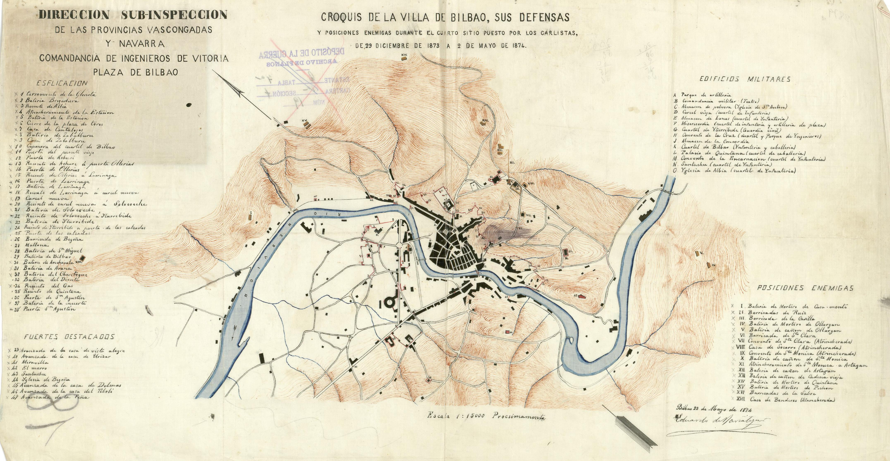

#Razón de ser de esta web.
Esta página web es una prueba con [Just the Docs] como base. Mi intención es convertir esta web en fácilmente accesible a cualquier persona interesada en mis antepasados por el simple hecho de que quizás sean también los suyos.

Me gustaría volcar en ella todos los datos genealógicos de los que disponemos en casa tanto en papel, vídeo, texto y otras plataformas de pago para que, cuando alguien, quizás dentro de muchos años se pregunte por sus antepasados y busque sus apellidos en internet, pueda encontrarse con una página abierta, gratuita e intuitiva.

¿Acaso no dicen que todos somos parientes, que el mundo es un pañuelo?
## Inspiración
Ha sido inspirada e influenciada por los [López, de Buenos Aires] y los [Ordóñez, de Pamplona] con cuyas webs me encontré buscando a antepasados que creí comunes y no lo eran. Cosa que descubrí gracias a sus webs que tanto me maravillaron cuando las ví por primera vez.

## Pruebas de imagen y texto
Por el momento solo estoy trasteando y no tengo ni idea de la mitad de lo que hago en esta web. Por ejemplo, esto es una fotografía que más adelante cambiaré:

Plano de Bilbao levantado en 1874, tras la ruptura del asedio carlista por el [*Grl. Concha*], con quien no tengo parentesco alguno ni jamás he vivido en su calle.

Me gustaría darle un aspecto elegante y profesional porque ahora mismo es más soso que un pasillo de hospital. 
Ya veremos como sigue la cosa... Espero poder dedicarle unos minutos cada día para contruirla y adencentarla poquito a poco.

[Just the Docs]: https://just-the-docs.github.io/just-the-docs/
[López, de Buenos Aires]: https://www.migenealogia.com.ar/
[Ordóñez, de Pamplona]: https://www.geneaordonez.es/ordonez.php
[*Grl. Concha*]: https://es.wikipedia.org/wiki/Manuel_Guti%C3%A9rrez_de_la_Concha_e_Irigoyen
